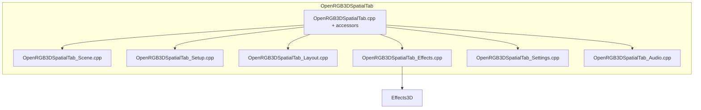

# Codebase audit workflow

Living checklist for **trimming dead code** and **consolidating translation units** after the Qt Designer / panel refactor. **Last full pass: May 2026.**

**Legend:** `done` = reviewed · `merge` = files combined · `keep` = separate by design

## Module map



| Module | Files | Notes |
|--------|-------|--------|
| Tab shell | `OpenRGB3DSpatialTab.cpp` (~2000) | ctor, signals, panel getters |
| Scene | `OpenRGB3DSpatialTab_Scene.cpp` | zones + reference points |
| Setup | `OpenRGB3DSpatialTab_Setup.cpp` | devices, scene controllers, display planes |
| Layout | `OpenRGB3DSpatialTab_Layout.cpp` | layout profiles, custom controller files |
| Effects | `OpenRGB3DSpatialTab_Effects.cpp` | stack UI, render, persistence, profiles |
| Settings | `OpenRGB3DSpatialTab_Settings.cpp` | `OpenRGB.json` session UI, profiles panel |
| Audio | `OpenRGB3DSpatialTab_Audio.cpp` | |
| Effect UI widgets | `EffectCommonPanels.cpp`, `EffectRowWidgets.cpp` | was 14 tiny `.cpp` files |

## Consolidation log

| Change | Status |
|--------|--------|
| Tab persistence ×3 → `EffectPersistence.cpp` | done |
| Tab stack ×4 → `EffectStack.cpp` | done |
| Tab zones + refpoints → `Scene.cpp` | done |
| Tab panel getters → end of `OpenRGB3DSpatialTab.cpp` | done |
| Object creator ×4 → `Setup` + `Layout` | done (May 2026) |
| Effect stack + persistence → `Effects.cpp` | done (May 2026) |
| Plugin settings + profiles → `Settings.cpp` | done (May 2026) |
| Card + device widgets → `ControllerCards.cpp`, `CustomControllerWidgets.cpp` | done (May 2026) |
| Effect row/common widgets ×14 → 2 files | done |

## Dead code removed (confirmed)

| Item | Status |
|------|--------|
| `ConfigureAmbilightUIEffect` / `ConfigureAmbilightRuntimeEffect` | removed |
| `ApplyAmbilightOriginVisibility` / `ApplyAmbilightGridScale` | removed |
| `IsAmbilightEffectClass(QString)` duplicate | removed |
| `on_effect_updated` (never connected) | removed |
| `on_granularity_changed` on tab (cards use widget slots) | removed |
| `on_add_clicked` (superseded by `on_available_card_add`) | removed |
| `createZoneButton()` tab accessor (unused) | removed |
| Effect start/stop/timer moved out of object creator into `EffectStack.cpp` | done |
| `selectedControllerRow()` (superseded by `currentSourceSelection()`) | removed (May 2026) |
| `RemoveWidgetFromParentLayout()` (zero call sites) | removed (May 2026) |
| Mid-file duplicate `#include` blocks in tab split TUs | removed (May 2026) |
| Unused includes (`QDebug`, dialog grid/slider/splitter) | trimmed (May 2026) |
| Alpha strict JSON (layout v6 gate, custom controller format v1, no fuzzy preset match) | done (May 2026) |
| `legacy_grid_pitch_mm` settings migration | removed (May 2026) |
| `FromJsonForController` (unused) | removed (May 2026) |
| Tab TU split: `LayoutCustomControllers`, `EffectsRender`, `EffectsProfiles`, `SetupDisplayPlanes` | done (May 2026) |
| `scripts/convert_controller_presets.py` (v0→v1 migration) | removed (May 2026) |
| Custom controller auto-fit-on-place checkbox + `MaybeGrowGridForPlacement` | removed (May 2026) |
| Layout load fallbacks (default spacing, optional camera/granularity) | removed — strict v6 fields only (May 2026) |
| Virtual controller JSON alternate spacing keys (`led_spacing_mm`, `NormalizeCustomControllerJson`) | removed (May 2026) |

## Kept by design

| Item | Why |
|------|-----|
| Per-effect `Effects3D/*/` folders | SRP — one effect per directory |
| `*.ui` under `ui/forms/` | Designer / `Ui::` types |

## Review checklist (full pass)

| Area | Status | Notes |
|------|--------|-------|
| Tab core | done | accessors merged; dead slots removed |
| Tab scene | done | |
| Tab stack | done | transport + ambilight prune |
| Tab persistence | done | |
| Tab audio | done | no dead slots found |
| Tab profiles | done | thin bind only |
| Setup + Layout | done | merged from 4 `ObjectCreator_*` files |
| Viewport / gizmo | done | no orphan APIs |
| Custom controllers | done | dialog + preview wired |
| Screen mirror | done | `ScreenMirrorMonitorPanel` only |
| Minecraft | done | |
| SpatialEffect3D | done | no orphan public API |
| Effects3D (47) | done | no duplicate REGISTER; categories verified |
| AudioInputManager | done | |
| GameTelemetryBridge | done | |
| Shaders / SpatialSamplers | done | all in `.pro` |

## File size targets

| File | Lines ≈ | OK? |
|------|--------:|-----|
| `OpenRGB3DSpatialTab.cpp` | 2000 | yes |
| `OpenRGB3DSpatialTab_Effects.cpp` | 2600 | monitor |
| `OpenRGB3DSpatialTab_Setup.cpp` | 2480 | monitor |
| `OpenRGB3DSpatialTab_Layout.cpp` | ~1250 | split from custom-controller TU |
| `OpenRGB3DSpatialTab_LayoutCustomControllers.cpp` | ~1020 | custom controller library |
| `OpenRGB3DSpatialTab_Effects.cpp` | ~1330 | split render + profiles |
| `OpenRGB3DSpatialTab_EffectsRender.cpp` | ~820 | `RenderEffectStack` |
| `OpenRGB3DSpatialTab_EffectsProfiles.cpp` | ~475 | effect profile JSON |
| `OpenRGB3DSpatialTab_Setup.cpp` | ~1795 | split display planes |
| `OpenRGB3DSpatialTab_SetupDisplayPlanes.cpp` | ~830 | display plane UI |

## Rules going forward

1. **SRP:** one class per `.h`; merge only `.cpp` in the same subsystem.
2. **&lt; ~2000 lines** per `.cpp` when practical.
3. **DRY:** one Screen Mirror wiring path; shared helpers in `*Internal.h` if split across TUs.
4. **Before delete:** `rg SymbolName` — zero hits outside definition.
5. **No legacy / backward compat:** do not add migration branches or old-format loaders; remove them when found. Document removals in the table above. **Exception:** viewport legacy GL for Qt 5.15 ([VIEWPORT.md](VIEWPORT.md)). Policy: [CONTRIBUTING.md](../CONTRIBUTING.md#no-legacy-or-backward-compatibility-paths).

## Verify

```powershell
rg "OpenRGB3DSpatialTab_ObjectCreator\.cpp|PanelWidgets|EffectStackRender|on_add_clicked|on_effect_updated"
cd build; qmake ../OpenRGB3DSpatialPlugin.pro CONFIG+=release; nmake
```

## LoadSettings UI sync

| Item | Status |
|------|--------|
| `EffectUiSync.h` + `EffectSliderRow::syncSliderValue` | done |
| `AudioReactiveUi::SyncSettingsToHost` | done |
| Spatial/audio custom panels | done |
